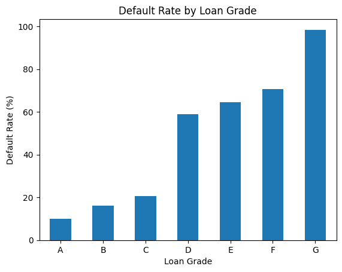
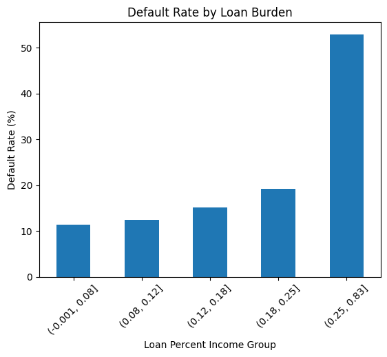
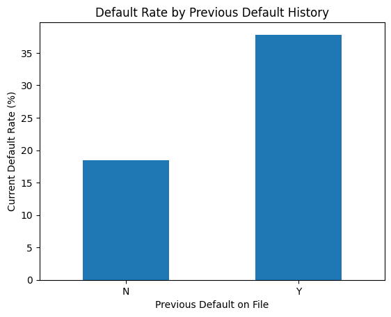
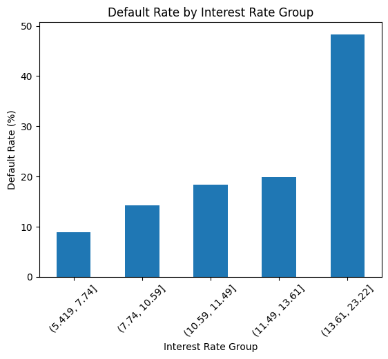
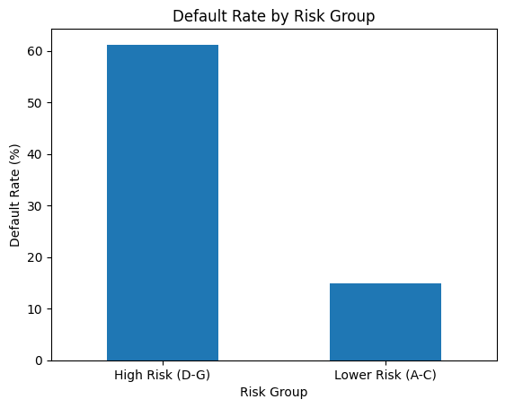

# Credit Risk Analysis

## Project Overview

This project analyzes borrower and loan-related data to identify patterns associated with loan defaults.

The analysis focuses on factors such as loan grade, loan amount, interest rate, loan-to-income burden, previous default history, income, employment length, loan purpose, and home ownership.

## Project Objective

The main objective of this project is to understand borrower risk patterns and identify factors that are associated with higher observed default rates.

## Dataset

The dataset contains information about borrowers, their income, employment history, loan details, credit history, and loan repayment status.

* Rows: 32,581
* Columns: 12
* Target variable: `loan_status`

  * `0` = Loan not defaulted
  * `1` = Loan defaulted

## Tools Used

* Python
* Pandas
* NumPy
* Matplotlib
* Seaborn
* Jupyter Notebook

## Data Cleaning

The following data-cleaning steps were performed:

* Checked for missing values.
* Checked for duplicate records.
* Invalid age values above 100 were treated as missing.
* Invalid employment length values above 100 were treated as missing.
* Missing age values were replaced with the median age.
* Missing employment length values were replaced with the median employment length.
* Missing interest rates were replaced with the median interest rate.
* The original dataset was preserved, and cleaning was performed on a copy.
* Final dataset contains 32,581 rows and 12 columns.
* Final dataset contains 0 missing values and 0 duplicate rows.

## Analysis Performed

The project includes analysis of:

* Default rate by loan grade
* Default rate by loan purpose
* Default rate by home ownership
* Previous default history vs current default
* Loan burden vs default rate
* Interest rate vs default rate
* Loan amount vs default rate
* Income vs default rate
* Correlation analysis
* High-risk borrower segmentation

## Key Findings

* Overall observed default rate was **21.82%**.
* Borrowers in loan grades **D–G** had an observed default rate of **61.18%**, compared with **14.86%** for grades A–C.
* Borrowers with loan-to-income burden above **25%** had an observed default rate of **52.93%**.
* Borrowers with a previous default record had an observed current default rate of **37.81%**, compared with **18.39%** for borrowers without a previous default record.
* The highest interest-rate group had an observed default rate of **48.33%**.
* Default rates varied across different loan purposes and home ownership categories.
* Income showed a weak negative relationship with default status.
* Age showed almost no linear relationship with default status.

## Visualizations

### Default Rate by Loan Grade



### Default Rate by Loan Burden



### Default Rate by Previous Default History



### Default Rate by Interest Rate Group



### Default Rate by Risk Group



## Project Structure

```text
credit-risk-analysis/
│
├── data/
│   ├── credit_risk_dataset.csv
│   └── credit_risk_cleaned.csv
│
├── notebook/
│   └── credit-risk-analysis.ipynb
│
├── images/
│   ├── default_rate_by_loan_grade.png
│   ├── default_rate_by_loan_burden.png
│   ├── default_rate_by_previous_default.png
│   ├── default_rate_by_interest_rate.png
│   └── default_rate_by_risk_group.png
│
└── README.md
```

## Conclusion

This project demonstrates how Python and data analysis techniques can be used to clean borrower data, explore credit risk patterns, calculate risk metrics, and communicate findings through visualizations.

The analysis provides a foundation for further credit-risk analysis and can be extended in the future with predictive modeling or an interactive dashboard.
